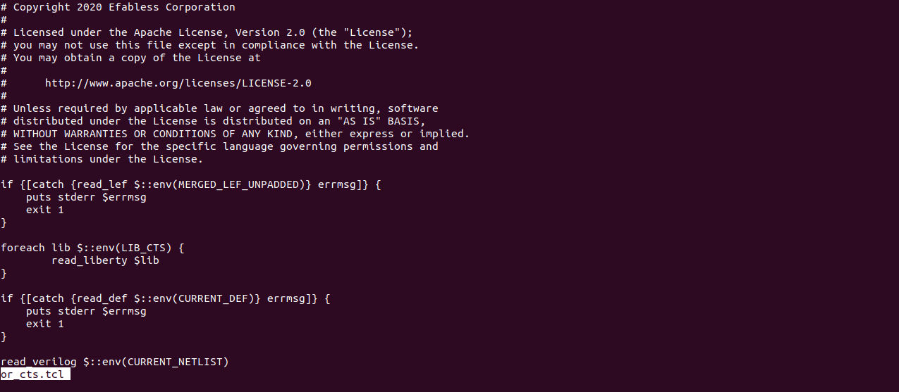

# Sky130A_Day4:Prelayout Timing analysis and Importance of Good clock Tree.

### **POWER AWARE CTS:**
Power-Aware Clock Tree Synthesis (CTS) is a design technique used in digital VLSI to create an efficient clock tree while minimizing power consumption. It is an essential part of clock tree synthesis (CTS), which focuses on distributing the clock signal with minimal skew and appropriate latency across the design. 

It balances the trade-offs between power, performance, and area (PPA), ensuring an efficient clock distribution network tailored for energy-efficient operation. 

 
In and gate, there will be two inputs, in which one of them is clock and another one is logic 1. then only clock will be passed to further stages, similarly in or gate when one of the input is zero then clock cannot be passed. Thorugh this we are saving lot of power and switching. This is a big advantage.

 At every level, each node must have the same capacitance load, and identical buffers must be placed. These are the two major conisderations for placing buffers.
 

### **DELAY TABLES:**
Delay tables are data structures used in digital design and electronic design automation (EDA) tools to model the delay characteristics of standard cells, such as logic gates, flip-flops, and other components. These tables provide timing information for various conditions, enabling accurate timing analysis during synthesis, placement, and routing.

Delay tables help in estimating:
   -  **1. Cell Propagation Delay:** The time it takes for a signal to propagate through a cell.
   - **2.Transition Time (Slew):** The time it takes for a signal to rise or fall between defined voltage thresholds.
   -  **3. Output Load Impact:** How the load capacitance at the output of a cell affects its delay and slew.
   -  
Delay tables are typically multi-dimensional arrays indexed by specific parameters, such as:
     - Input Slew (S): The transition time of the input signal.
     - Output Load Capacitance (C): The capacitive load connected to the output of the cell.
      
Each cell in the delay table corresponds to a specific delay or transition time value for a given combination of input slew and output load.

### **SET UP TIMING ANALYSIS:**

#### **LAUNCH FLIPFLOP:**
The launch flip-flop is the flip-flop where the signal starts its journey.It launches the data onto the combinational path when its clock edge triggers it.The output of the launch flip-flop propagates through the combinational logic and is expected to reach the input of the capture flip-flop within the timing constraints. 

#### **CAPTURE FLIPFLOP:**
The capture flip-flop is the flip-flop that receives the data at the end of the combinational path.It captures the incoming signal when its clock edge triggers it.For proper operation, the data must satisfy setup time and hold time requirements relative to the clock edge of the capture flip-flop. 

#### **SET UP TIME:**
Setup time is defined as the time interval during which the input signal must remain stable before the active edge of the clock (rising or falling edge, depending on the design).

 #### **HOLD TIME:**
 The capture flip-flop is the flip-flop that receives the data at the end of the combinational path.It captures the incoming signal when its clock edge triggers it.For proper operation, the data must satisfy setup time and hold time requirements relative to the clock edge of the capture flip-flop. 

### **SET UP TIMING ANALYSIS:** 
The setup timing check can be measured as following for ideal clocks. The setup timing checked always at the next clock edge. 

Here theta is considered as combinational delay and T is time period. According to set up timing analysis combinational delay is always less than time period.

Since, considered is ideal clocks this is the necessary conditon when compared to the real clocks we have clock uncertainity and some zitter issues, so the condition may change.

Let us know about zitter.

**JITTER:**
Jitter is the deviation in timing of a signal from its ideal position in time. It is typically caused by noise, electromagnetic interference (EMI), crosstalk, or variations in power supply.

The equation for setup timing analysis is given as follows:

 (Clk-to-Q)+(Combo.) < (Clock Period)–(Clock Skew)–(Clock Uncertainty) CLK-TO-Q + COMBO < T - S - U 
 
In the above equation, CLK-to-Q + COMBO -----> Data Arrival Time T - S - U ------> Data Required Time 

From the definition, Slack = Data Required Time - Data Arrival Time

 If slack is positive, that means there are no timing violation in case of setup timing check. If Slack is negative, that means, there is a Setup violation, and we have to optimize the design to discard the violation. 
 
For real clocks the buffers are also present in the Clock path.Let’s see an example which considers the setup timing check with real clocks. While considering the real clocks, the delay of buffers is also considered as a part of the Clock Time period and as well as in Arrival time.

### **HOLD TIME ANALYSIS:**
The setup timing check can be measured as following for ideal clocks. The setup timing checked always at the same clock edge 

Here, for setup timing analysis, the total delay i.e, from clk of launch flop to the capture flop including the combo. Delay must be less than the Hold time. As we know, in real time i.e., for real clocks, the concept of Hold uncertainty, buffer delays are also considered. So the timing check for Hold can be modified as. 

The equation Hold time analysis is given by,

(Clk-to-Q)+(Combo.) > (Hold Time) + (Hold Uncertainty) CLK-TO-Q + COMBO > H + HU 

In the above equation, CLK-to-Q + COMBO -----> Data Arrival Time H + HU ------> Data Required Time 

From the definition, Slack = Data Arrival Time - Data Required Time.

### **CLOCK TREE SYNTHESIS:**
Clock Tree Synthesis (CTS) is a crucial step in the VLSI physical design flow, responsible for distributing the clock signal from the clock source (like a phase-locked loop or PLL) to all clocked elements (e.g., flip-flops, latches) in a chip. The goal of CTS is to ensure that the clock signal arrives at all these elements with minimal skew and latency, while meeting timing, power, and area constraints.

**YOU SHOULD  NOT GIVE CLOCK AS SHOWN BELOW:**

**YOU SHOULD GIVE CLOCK AS BELOW:**

Due to the above longer wire length, delay will be increase, we need to place buffers in order to maintain zero skew.

Coupling capacitance arises primarily due to the proximity of signal traces (such as clock lines) to each other on the chip and can lead to undesirable effects such as clock skew, signal integrity issues, and increased power consumption. If any logic is transmitted through a net that affects another neighbouring net due to capacitive coupling is known as crosstalk.

So to improve the clock tree Synthesis without formation of any decoupling capacitance, we have to maintain certain distance between clock lines. If we follow such rules, there is no formation of Coupling capacitance between to parallel clock lines, and it results in a proper clock tree formation. And there is another disadvantage of placing the parallel clock lines nearer to each other known as delta delay. In clock tree synthesis (CTS), delta delay refers to the difference in delay experienced by various paths of the clock tree. It's an important parameter to consider because it directly affects the skew, which is the variation in arrival times of the clock signal at different points in the chip

To make ensure that there is no formation of Decoupling capacitance and there is no effect of delta delay in clock tree synthesis, one of the effective technique known is clock net shielding.

VDD and VSS lines protect the clock signal from coupling and to prevent delta delay. In clock net shielding, the clock signal is shielded by the vdd and vss signal lines that is power and ground lines. The purpose to shield the high speed clock signal is to protect the data paths and clock signals from radiated noise and radiated emissions. 

After the process of clock net shielding, the layout we can see is as follows: 

### LABS:

- now to include sky130_vsd.inv follow the steps below:
- to run synthesis, first run all the commands below:
 

after that, we can see as follows:

now for running for floorplan use commands:

now after floorplanning we can see merged.lef

 after run placement
  

we can view in magic
  

 in that we can see our newly placed sky130_vsd_inv,here i just showed an example of nand3:
 
 

 let us write pre_sta.conf for sta_anlysis
  
to run sta type the command **sta pre_sta.conf**
   

to remove slack type the following command

 

now slack changed to tns to zero

 

 now run cts using following command:
 
  

  lets us see cts_readme file
  
   

 let us see cts_procs
  

cts_results are given below:

 

 Now lets go to the openroad directory
 
  

lets us or_cts.tcl

let us check all the variables

let us check the capacitance of buffer_16

#### **Starting Openroad_flow**

let us write db file which is done by both lef file and def file

reading liberty files

let us see report checks

we get a slack as below, which is not correct

to get new slack, do the following steps:

we get slack as below

let us check what happens to the slack after removing buffers.
so,to remove buffers use the following command

we can observe there is no buffer 1

the obtained slack is

let us check hold and setup reports

again to readd the buffer use the commands

let us see the image after_cts

