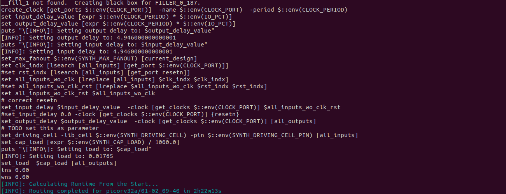
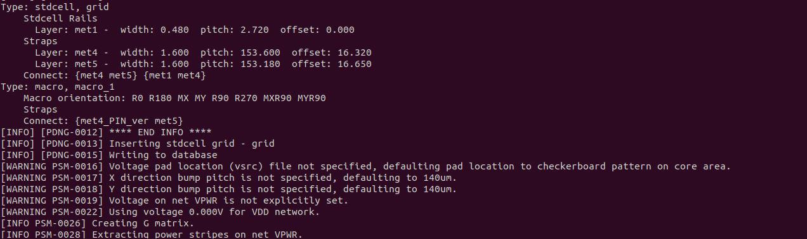

# Sky130_Day5:FINAL STEPS FOR RTL2GDS USING TRITON ROUTE AND OPEN STA 

### **ROUTING:**

Routing in VLSI design refers to the process of creating physical connections between various components, such as transistors, logic gates, or blocks, within a chip layout. It involves defining the paths for electrical signals to flow through interconnects, ensuring that all the necessary connections are made while adhering to design rules, timing constraints, and electrical requirements. Routing typically occurs in two phases: global routing, which plans approximate paths at a higher level, and detailed routing, which defines the precise tracks and layers for each connection. Tools use multiple metal layers in modern designs to efficiently handle dense interconnections while minimizing resistance, capacitance, and signal delays. Challenges in routing include avoiding congestion, managing cross-talk, and meeting timing and power constraints, making it a critical step in achieving a functional and manufacturable design. 

## **INTRODUCTION TO MAZE ROUTING LEE’S ALGORITHM:** 

There’s a most popular algorithm for routing known as Maze routing lee’s algorithm.Maze Routing using Lee's Algorithm is a pathfinding technique used in VLSI design to determine a connection between two points (e.g., source and target pins) in a grid-like layout while avoiding obstacles. It is a breadth-first search (BFS) algorithm that guarantees finding the shortest path if one exists. The grid cells represent possible routing spaces, with each cell either free or blocked. Starting from the source, the algorithm explores neighboring cells level by level, marking each with a cost that represents the number of steps from the source. This process continues until the target is reached or all possibilities are exhausted. Once the target is found, the path is traced back using the cost markings   This algorithm represents the routing algorithm as follows:

This algorithm will be followed by selecting the adjacent cells of every cell excepting the diagonal cells. It is shown below

### **DRC RULES:**

Design Rule Checks (DRC) are a set of rules used in VLSI design to ensure that a chip's physical layout adheres to the manufacturing process's limitations and requirements. These rules are defined by the foundry (fabrication facility) to guarantee the design can be reliably manufactured without defects and will function as intended.

There are so many design rules that should be followed as a part of routing process. Also, there are some typical rules, that should must follow while routing is going on. 

- Wire width
- Wire pitch
- Wire spacing
- Via width
-  Via spacing
-  
   **WIRE WIDTH:**
using optical photolithography used, we make metal connections.As light have a minimum wavelength, using it, we can make minimum width of metal connections. It means the optical wavelength of light can make metal connections.
    

 **WIRE PITCH:**
 
We have to optimize the layout, to maintain a  minimum wire pitch.

**Wire Spacing:** The minimum distance between the edges of two adjacent wires to prevent short circuits or crosstalk.

**4. Via Width:** The size of the via (contact hole) that connects two metal layers.

**5. Via spacing:** The DRC rule specifies that the minimum spacing between two vias is maintained. They should be at any maximum distance, but min distance is maintained, to make ensure the drc is not violated.
### **PARASITIC EXTRACTION:**

Parasitic Extraction is the process of identifying and quantifying the parasitic effects—such as resistance, capacitance, and sometimes inductance—present in a chip's physical layout. These parasitics arise due to the interconnects (wires, vias) and their interactions with surrounding materials, especially as technology scales down to nanometer nodes. Parasitic resistance can lead to voltage drops, increased power dissipation, and degraded signal strength, while parasitic capacitance can cause delays, increased power consumption, and signal coupling issues, adversely impacting the circuit's speed and reliability. The extracted parasitics are critical for accurate post-layout simulations to evaluate the circuit's real-world performance, including timing, power, and signal integrity. 

### **TRITON ROUTE:**

TritonRoute is an open-source detailed router developed as part of the DARPA-funded OpenROAD project. It is designed to perform detailed routing in VLSI physical design, connecting all the pins and nets in a chip layout while adhering to design rules (DRC) provided by the foundry.

TritonRoute performs both global and detailed routing. Global routing establishes high-level routing architectures, determining the approximate paths for each net. Detailed routing fine-tunes these paths, considering specific physical constraints and optimizing for factors such as signal integrity, timing, and manufacturability. Global Route / Fast Route : It is being done by fast route. 
Detail Route : It is being done by tracking route. 

Preprocessed Route Guides in TritonRoute are refined routing paths derived from the initial global routing results to assist the detailed router in efficiently completing the layout. These guides are prepared to ensure compliance with design rules and improve routing quality by managing path complexity and congestion.

   - **1. Initial Route Guides:** These are generated by the global router and provide a coarse representation of paths for each net. They define the regions in the layout where the connections for a net should be routed, without detailing the exact tracks or layers.
- **2. Splitting:** During preprocessing, large or complex route guides are divided into smaller, manageable segments. This step allows the detailed router to handle local connections more precisely and avoid overlaps or violations.
     
 - **3. Merging:** Overlapping or adjacent route guides for the same net are combined into a unified guide. This helps reduce unnecessary fragmentation and simplifies routing paths, ensuring smoother and more efficient connections.
 - **4. Bridging:**  If a net is divided across disconnected guide regions, bridging is applied to create intermediate guides that link these regions. This ensures continuity in routing paths, preventing disconnected segments.
 -  **5. Final Preprocessed Route Guides:** After splitting, merging, and bridging, the guides are finalized to be compact, contiguous, and optimized. These guides are fed into the detailed router to direct its operations, improving efficiency and ensuring compliance with design rules.

By preprocessing route guides, TritonRoute enhances routing accuracy, reduces DRC violations, and ensures high-quality layouts in the detailed routing phase.

### **INTER-GUIDE CONNECTIVITY:**

Inter-Guide Connectivity refers to the process of ensuring that adjacent or overlapping route guides—regions that indicate where nets should be routed—are properly connected during the detailed routing phase in VLSI design. Route guides are initially provided by a global router to guide the detailed router, and inter-guide connectivity ensures that these guides are continuous and form valid, uninterrupted paths for signal routing. 

### **Intra-Layer Parallel Routing :**

Intra-layer parallel routing refers to the process of routing multiple nets simultaneously within a single metal layer in a parallel fashion. This technique is commonly employed to optimize the routing process by leveraging the available routing resources within the layer. By routing multiple connections at the same time, intra-layer parallel routing minimizes the time taken for routing while ensuring efficient use of horizontal or vertical tracks. However, it must consider constraints like minimum spacing, wire width, and crosstalk avoidance to ensure compliance with design rules. This approach is particularly beneficial for high-density regions in modern designs, where congestion is a concern, as it allows for an organized and efficient layout.
### **Inter-Layer Sequential Panel Routing**
Inter-layer sequential panel routing involves routing connections across multiple layers in a sequential manner, typically moving from one layer to the next as the routing progresses. This method is used when routing requires vertical transitions, such as moving between metal layers using vias. It prioritizes the orderly completion of routes in one layer before progressing to the next, which helps maintain clarity and minimizes conflicts between layers. Inter-layer sequential panel routing is crucial in multi-layer designs where the vertical dimension (z-axis) is extensively used to reduce congestion on individual layers and achieve routing closure while adhering to design rules for vias, spacing, and layer usage.

Both methods are complementary and are used together in modern routing tools to achieve high-quality layouts in complex designs.

Let’s see how, trintonroute handles the process of routing and what are the parameters required for the tritonroute 

### **Routing topology algorithm:**

 Routing topology algorithms aim to find the optimal arrangement of routing paths between components while adhering to design rules, constraints, and optimization objectives. They play a crucial role in determining the overall efficiency, performance, and manufacturability 
 

### LABS:
- To generate power_delivery_network use the command **gen_pdn** command
  

- after generating pdn and now let's run routing using **run_routing**
- after we get output as following.
  
  - spef file will be also be generated
    
   

  let us see std_rails:
   

  - after routing we can see picorv32a
    
    
  

  

